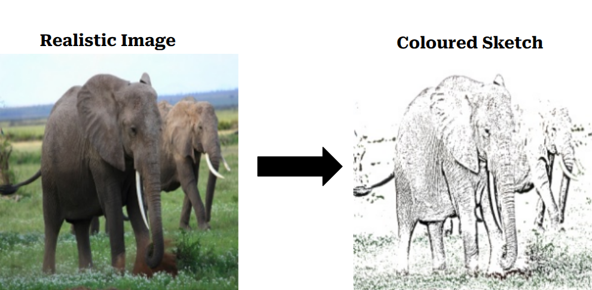

# Sketch2Real
#### Generating realistic images from a colored sketch using a diffusion model based on a conditional U-Net
#### Extra Criteria: GUI
#
## Getting the Dataset
 I used the coco_dataset for this project. I generate the sketch, do the following steps:
#
 1. Convert it to Grey Scale
 2. Invert the grey scale
 3. Apply Gaussian Blur
 4. Invert the pixels
 5. Get the edges by binary_thresholding
 6. Replace the egdes with the original colors

  
 

## Model Architechture:
### I tested 2 models
### Model - 1
In this model, I used 128 x 128 size for the image and had 5k images in my dataset
1. **Noise schedule used:** Cosine Noise Schedule
2. **Optimiser:** AdamW
3. **Loss Function:** L1
4. **Activation Function:** SILU

### The Conditional U-Net Architcture is as follows:  
#### INPUT
 (concatenating noisy image + sketch) -> Initial Conv (6 -> 64) + timestep embedding added (128 channels)      

#### ENCODER (Downsampling)

 DownBlock 1:  128 -> 32 channels
 DownBlock 2:  32 -> 64 channels
 DownBlock 3:  64 -> 128 channels

#### (Bottleneck)

 ResidualBlock1: 128 -> 256
 ResidualBlock2: 256 -> 256
 ResidualBlock3: 256 -> 128

#### DECODER (Upsampling)

 UpBlock 1:  128 -> 64 channels  (+ skip)
 UpBlock 2:  64 -> 32 channels  (+ skip)
 UpBlock 3:  32 -> 16 channels  (+ skip)

#### Final Conv (16 -> 3)

#### OUTPUT
 (predicted noise image)

### Image Generation (reverse diffusion)

Starting from pure gaussian noise, iteratively denoise over given number of steps.
At each time step and the next time step, I get signal_rate and noise_rate using cosine schedule.
The Conditional U-Net takes the noisy image x, the sketch, and the current noise variance as input, and predicts the noise component. From that, a clean image estimate is reconstructed:

*predicted_image = (x - noise_rate × predicted_noise) / signal_rate*

The noisy image for the next step is then re-composed using the next step's rates:

*x_next = signal_rate_next × predicted_image + noise_rate_next × predicted_noise*

This process repeats until x converges to a realistic image conditioned on the sketch. 

